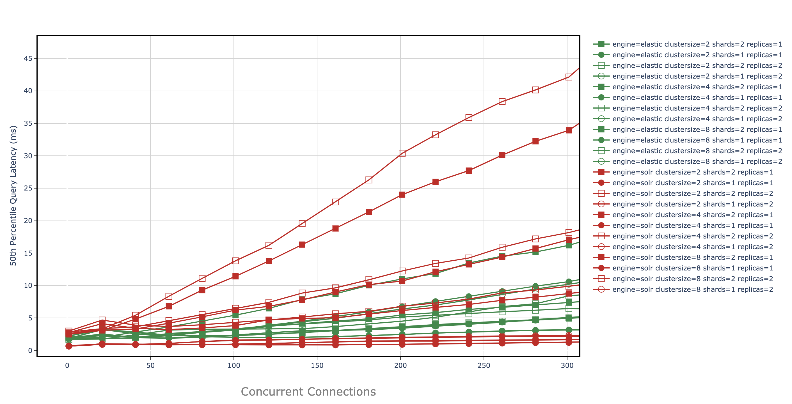

## SAPA: a tool for Search Agnostic Performance Analysis

### OVERVIEW

Sapa provides an automation tool for deploying and benchmarking SolrCloud and Elastic search engines. The overarching purpose of this project is to provide a framework for quickly discovering optimal deployment strategies given organizational constraints. Search engine config state space is incredibly large (fig1). Consequentially, tuning these apps for performance requires a lot of guesswork since there is no silver bullet when it comes to the best configuration. Sapa takes the guesswork out of performance tuning by providing a tight feedback loop on your deployment strategies. If you have been diagnosed with "search engine configuration fatigue", or suspect there are performance bottlenecks and want to efficiently explore all your options?... SAPA is the tool for you.
 
 fig 1 | notes 
 ---- | ----
  | The single line traversing this state space represents a single deployment. This graph illustrates a simple example of a deployment state space definition; each color represents a config category, and each dot represents a configured value. Many production systems will choose to compare many more verticals.  
 


Key Terminology:
- `sapa_bench` = sapa_bench is the term to descibe a sapa run from end to end. Put simply, it's the core use case for sapa. It's defined as a experiment to benchmark N number of search engine deployments and compare the results.
- `statespace` = the statespace is the particular settings for a single deployment. 
- `deployment` = a particular instance of elastic or solrcloud with a defined statespace 

Importantly, statespace is composed of three sub spaces, and each has an impact on search performance.

- `config`: these are the knobs provided to users for tuning the instance of the search engine. _e.g. solrconfig.xml, elasticsearch.yml, replicas, shards, etc._
- `workload`: these settings generally define the interactions with search engines during the experiment, most notably the workload settings. _e.g. search term dictionary, documents, load balancers, client apis, etc_
- `env`: defines things such as JVM settings, clustersize scaling, local, remote configs.
**e.g. clustersizes, cluster replications, JVM settings, docker,  network configs, etc**

other sapa_bench options: 
- `viz`: declare visualizations to generate with the performance data. _e.g. cdfs, latecy->throughput, 
- `plug`: experimental integrations to plug into the enviornment. The goal with this is to inject a binary into the experimental flow to enhance performance. e.g. rate limiters, service proxies, multitenenant, etc.  

Sapa's CLI makes configuring the statespace for multiple deployments simple. The CLI sole purposes is to populate sapa_.yml files for each deployment. The best practice is to generate the .yml files using for example `sapa create e_1:elastic e_2:elastic s_1:solr s_2:solr`. This will generate the template files which you can manually reconfigure, or do so with the CLI commands. A savvy user may choose to use the cli in a bash script that can be saved and perhaps replayed or archived. 

Importantly, the last paramater for each cli command is a comma separated list of deployment names given in the create step. Optionally, all and ! are tokens that represent *all* deployments, and *sans* deployment. So you can for instance use `all,!elastic1` which will apply those settings to all but the elastic1 deployment. 

```
$ sapa deployments <key:name1> <key:name2> <key:name3> 
$ sapa config <key:value> <key:value> <deployments>
$ sapa workload <key:value> <deployments>
$ sapa env <key:value> <deployments>
$ sapa plug </path/to/binary> <other_options> <deployments> 
$ sapa viz <viz_type1> <viz_type2> <deployments>
$ sapa show states <deployments>
$ sapa run <deployments>
```
 
 
### SIMPLE EXAMPLE

a simple use case:
John wants to know what search application and configuration has the lowest P99 latency given a particular load. 
```
$ cd sapa
$ sapa deployments solr:solr1 solr:solr2 elastic:elastic1 elastic:elasic2
$ sapa env RAM:20G all,!elastic2 ;
$ sapa configconfig queryCache:9999 documentCache:9999 all,!elastic1,!elastic2 ;
$ sapa workload loop:open all ;
$ sapa workload load_start:1 load_finish:100 solr1,solr2;
$ sapa workload load_balancer:clients all,!elastic2;
$ sapa plug ratelimiter /path/to/ratelimiter/binary all,!elastic1 ;
$ sapa viz cdf_91 total_throughput all
$ sapa show states all ;

| ****** elastic1 ****** | ******* elastic 2 ******  | 
    ENGINE: elastic         ENGINE: elastic
    RAM:    60G             RAM:    1G #default
    LOOP:   open            LOOP:   open
    ... 

$ sapa run <experiment_name> all ;

```

__need to tell a story here, basically a placeholder for now__

 fig 2: CDF 1 connection | fig 3: horizontal scaling performance @100k documents
 ---- | ----
 | 
 
 fig 4: CDF 101 connections | fig 5: MAX Throughput
 ---- | ----
  |  

 fig 6: median latency | fig 7: P99 latency 
 ---- | ----
  |  


### INSTALLATION

Requirements:
To deploy you need to set up a local and remote env

##### LOCAL:  
Create a python3 virtual env:  
`pyenv activate your_env`

install packages:  
`pip install ansible paramiko Jinja2 numpy`


##### REMOTE:  

_SAPA provides benchmarking even if you don't have cloud resources but emulating them with Docker locally. So, if you choose this route, please_:
- add 0.0.0.0 as hostname for config file in ~/.ssh/config for all servers used in docker-compose.yml (see config-host.example)
- make sure docker desktop configuration allocates enough CPU cores and RAM (50% of your machine is good)
- run `$ bash container_rsa.yml` to load ssh keyss into your containers. 


###### for standard cloud deployment:
step1: 
place the domain names in clouddnsfile and run `getips.py <username> <clouddnsfile> <path_to_private_rsa_key> <#load nodes>` 
clouddns file example:
```
ms1.utah.cloudlab.us
ms9.utah.cloudlab.us
ms5.utah.cloudlab.us
ms4.utah.cloudlab.us
ms3.utah.cloudlab.us
...
```

this will generate >> `inventory_gen.txt` file. swap this file with `./inventory`


#### -> if you are installing from github source:
*these steps fork the solr repo, check out a specific branch, and duplicate that branch to your own dev branch.*
- fork the lucene-solr repo https://github.com/DavidCPorter/lucene-solr.git
- add ssh keys from solr nodes to github account (temp solution so ansible can easily update repos remotely)
- locally clone repo
- checkout branch_8_3 (or whatever solr version you want)
- create new branch <name> e.g. `git checkout -b <name>`
- push <name> branch to origin
- replace git_branch_name=dporter_8_3 in inventory to git_branch_name=<name>
- replace `dporte7` in ansible role "vars" and "defaults" files with your username in cloudlab

#### -> else: 
- you will simply specify version in yaml. 


##### LOAD env helpers utils.sh and be sure to replace SAPA_HOME and CL_USER var with your path for this app.

#### set up shell envs
1. run `ansible-playbook cloud_configure.yml` .. this will also generate utils.sh locally @ /benchmarkscripts/utils/utils.sh
2. then, run `ssh_files/produce_ssh_files.sh` to create files for pssh tasks dependencies in runtest.sh (this uses utils.sh)


#### FOLLOWING IS README WIP :::

#### run experiment
*before you run any experiment you want to make sure solr is not running `checksolr` and that there is no indicies on the cores `listcores`*
*make sure the utils are updated  loaded first*
*make sure to edit params file*
fulltest < list of solr clusters >
e.g. if i wanted to run scaling experiment on 2 4 8 and 16 clusters and compare the performance, I would run this:
`fulltest 2 4 8 16`

**IF YOU EVER EXIT an experiment or it fails... make sure to remember run `stopSolr <clustersize>` and `wipecores` and `killallbyname dstat` `callingnodes rm *.csv` before you continue**
*FURTHERMORE, if the exp posted_data (indexed) for the first time, you might want to consider deleting that collection via solr admin and redoing the experiemnt becuase the final step in the exp is to save to aws and that would not have happened in a failed exp... you can either run the ansible script to post to aws, or just redo it after deleting*

**It's important to remember that the disk space on the cluster is small ~10GB so any more that 4 replicas will prolly fail due to disk size failure. This is why there is the posting the index to aws (if prev nott there ) and removing it after each exp so you dont hit the limit.**


### NOTES
#### Notes on Solr Config
*This is completed automatically during the solr config step with the ansible playbooks.*

I found the easiest way to connect with the remote JMX is to modify this line in the ~/solr-8_0/solr/bin/solr executable

`REMOTE_JMX_OPTS+=("-Djava.rmi.server.hostname=$SOLR_HOST")`  
to  
`REMOTE_JMX_OPTS+=("-Djava.rmi.server.hostname=$GLOBALIP")`


#### Notes on Ansible Roles:
There are five roles in this repo `cloudenv, solr, zookeeper, upload_data, benchmark, elastic` located in the /playbooks/roles dir. You can take a look at the procedures for setting up the envs in ./roles/<role_name>/tasks/main.yml

#### Notes on Ansible Variables
when you run ansible playbooks, the process will generate sys variables, and to view these you can run `ansible -i inventory -m setup`
`hostvars`
`VARIABLE PRECEDENCE`
If multiple variables of the same name are defined in different places, they win in a certain order, which is:
- extra vars (-e in the command line) always win
- then comes connection variables defined in inventory (ansible_ssh_user, etc)
- then comes "most everything else" (command line switches, vars in play, included vars, role vars, etc)
- then comes the rest of the variables defined in inventory
- then comes facts discovered about a system
- then "role defaults", which are the most "defaulty" and lose in priority to everything.


