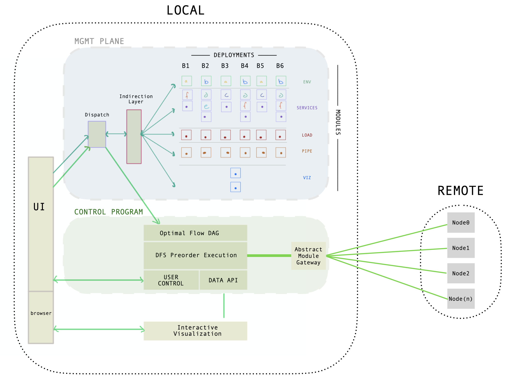

 

## JANUS: cloud-native benchmarking framework 

JANUS is a framework to manage, orchestrate, and execute cloud-native benchmarking experiments.


### Overview:
In the simplest terms, JANUS provides an abstraction for benchmarking cloud-native architectures ("deployments"). The abstraction looks like this: 

 

- each color maps to a Tuple(module, config_params) as an architectural cloud-native component
- each `deployment` vertical is a full architecture stack to be evaluated
- `stages` serve as an organizational construct for building the experiment
- each stage contains JANUS `modules` (jmods) that perform tasks using Ansible Syntax. 
- config_params are variables configured with JANUS' cli or janusfile. 
- `execution schedule` is the optimal execution path for reducing redundancy in orchestrating and executing these deloyments. 

*The end goal of JANUS is to produce interactive visuals comparing each "deployment"; see appendix for examples of these visuals*

#### design goals
- **Intuitive design:** reasoning about the system should be simple
- **Transparency:** the state of experiments are checkpointed in the local filesystem. These data can be checked into VCS giving users support to share state of their experiments.  
- **Easy Adoption:** leverage users skills in popular provisioning and orchestraton framework and syntax for module development. 

#### nongoals
- JANUS is a framework that requires user module implementation. If JANUS gains traction in the community, it's expected others would provide modules similar to ansible roles and they would be available in shared repositories. 


#### MOTIVATION:

Orchestration, monitoring, and tracing tools do a great job with real-time insights on a live deployment, but they simply are not designed to facilitate evaluations across many deployments and configurations. 

The accelerated trend in open source cloud-native development and multi-cloud infrastructure has become a double edge sword for system architects. Cherry picking services for domain-specific architectures makes enterprise development swift and powerful. However, the vast number of services in the open source ecosystem can leave engineers paralyzed by choice. A prudent engineer would conduct a fair evaluation of these architectures before making an investment. One key type of evaluation is performance benchmarking. Benchmarking is often a fickle task, requiring each service to be configured and operated in any number of infinite states. This quickly becomes unrealistic as you expand the scope of systems to evaluate since the complexity of conducting a fair evaluation reduces to (x systems * y configurations * z evaluations). 

JANUS simplifies this approach with a generalized framework to orchestrate, manage, and execute experiments across a variety of system configurations and deployments. 


## Design Overview

JANUS provides a management plane and control program for building, deploying, and executing a benchmarking experiment. The MGMT Plane prepares the orchestration of various deployments. Control program generates execution graphs and orchestrates the experiment. 

 


An important design goal of JANUS was maintaining an abstract view of the modules that make up a system's architecture. Users can adapt their systems to JANUS easily with a familiar syntax and simple interface. Modules can be created and plugged into JANUS in one of 5 stages:

1) `ENV` environment running the software
2) `SERVICES` core features of the cloud-native system
3) `LOAD` hammer the servers with requests
4) `PIPE` pipe and filter data tasks
5) `VIZ` interactive visualizations


 module interface | *  
 ---- | ----
 | Each module contains at least one yaml file describing the operations to "activate" and "deactivate" the module using Ansible syntax. JANUS will parse varibles in these files to learn dependencies and provide default VARS file for users. Users override these defaults with the janusfile and/or cli. 


#### CONFIG PARAMS

JANUS makes extensive use of variable overriding and abstractions to support many parts of the framework. Ansible provides the middleware for JANUS, however, the IAC tool's strong opinions on variables and role management made the traditional Ansible use case incompatible. Therefore, to some extent, JANUS utilizes Ansible in an unconventional way to simplify variable managment. 

Users can dynamically set variables with JANUS cli, load them from a janusfile, or leave them to their default behavior. JANUS will use variable precedence to construct the Optimal Flow DAG (execution schedule), and will load these at runtime for dynamic configuring, building, and deploying plays. Example of a module with three files for downloading, configuring, and running zookeeper: 
['download' play in zookeeper module](./jmods/service/zookeeper/plays/1_download_stasks)


#### EXECUTION SCHEDULING
Once the Management Plane does it's job of preparing the orchestration of each deployment, the Control Program's reponsibility is to compute a dependency tree and learn which branches of the experiment share the most modules and plays, then figure out which plays to branch on given the variables, and construct the optimal execution path to minimize redundancy. Broad strokes look like this: 
 

### Install/Setup
Later versions of JANUS will be released as a pip package.  

Current install requires:
`git clone git@github.com:DavidCPorter/janus-framework.git`

python3 environment with these packages: 
`pip install ansible paramiko Jinja2 numpy more_itertools itertools pyyaml`

Recommended:
I personally set up an alias to load this file on my machine to activate JANUS dev env. 

```
#!/bin/bash
pyenv activate ansible
export JANUS_HOME=/PATH/TO/JANUS_HOME
export ANSIBLE_CONFIG=$JANUS_HOME/experiments/ansible.cfg
PATH=$PATH:$JANUS_HOME/utils/bin
cd $JANUS_HOME
```


##### CLOUD INFRASTRUCTURE SETUP: 
create inventory file with hosts 
Most notably, you will need globally addressible nodes and a subnet connecting them.
Modify the inventory example with your own IPs. 
`utils/default_inventory`

##### LOCAL CLOUD INFRASTRUCTURE SETUP (DOCKER): 
If you do not have cloud infrastructure, JANUS provides docker files to emulate a small cluster locally. The files launch a 5 node local ubuntu18 cluster. Be sure to set appropriate Docker engine resources to support docker-file resource allocation (see docker-compose). 

steps to consider for Docker cloud emulation support:
- add 0.0.0.0 as hostname for config file in ~/.ssh/config for all servers used in docker-compose.yml (see config-host.example)
- make sure docker desktop configuration allocates enough CPU cores and RAM (50% of your machine is good)
- Load to load ssh keys into your containers.`container_rsa.yml` is an example of this. 


### Usage
Once installed, JANUS can be used with this CLI:
```
$ janus new --name <name> --branches <branchlist>
```
```
$ janus new --name experiemnt --branches branch1,branch2,branch3
$ janus <name> 
 > add [modules] [module_names] [branches]
 > add [vars] [key] [value] [branches]
 > add [hosts] [groupName] [module] and/or [play] [branches]
 > order [modules] [module1] [module2] ... [branches]

* "ls" will display user-entered info 
 > ls [vars] 
 > ls [modules]

* "show" will show execution order and will show runtime values
 > show [vars]
 > show [modules]
```

example:

```
$ janus new --name experiment1 --branches branch1,branch2,branch3
$ janus experiment1
 > 
 > add modules cloud-env all http_closed_loop cdf all
 > 
 > add modules solr solr_index solr_pipe zookeeper all!branch3
 > order modules cloud-env zookeeper solr solr_index http_closed_loop solr_pipe cdf all!branch3
 > 
 > add modules elastic elastic_index http_closed_loop es_pipe cdf branch3
 > order modules cloud-env elastic elastic_index es_pipe cdf branch3
 > 
 > add vars shards 2 replicas 6 all
 > add vars min_conn 1 max_conn 300 increment 10 all
 > add vars heap 5 branch1
 > add vars heap 2 branch2
 > add vars heap 1 branch3 
 > 
 > add hosts fourNode solr all
 > add hosts fourNode elastic
 > 
 > start all
 > [or] 
 > start show vars

* show vars will print runtime variable values
```
Longer term goal is to implement a UI using REACT and reactdnd. 

### APPENDIX
- example of solrcloud vs elastic with various configs interactive visual outputs

 

 

